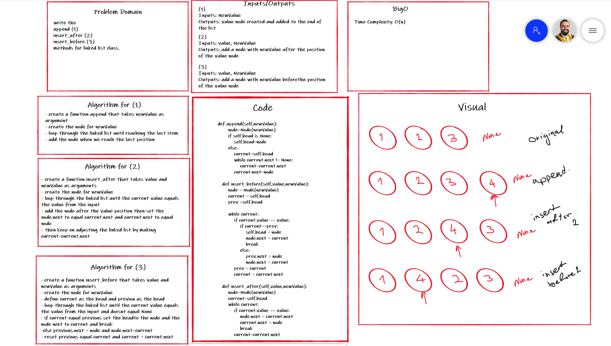
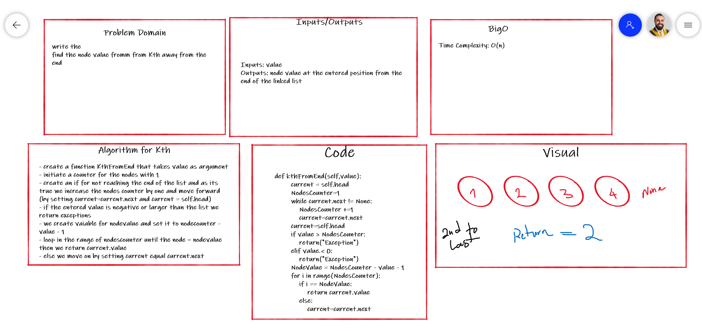
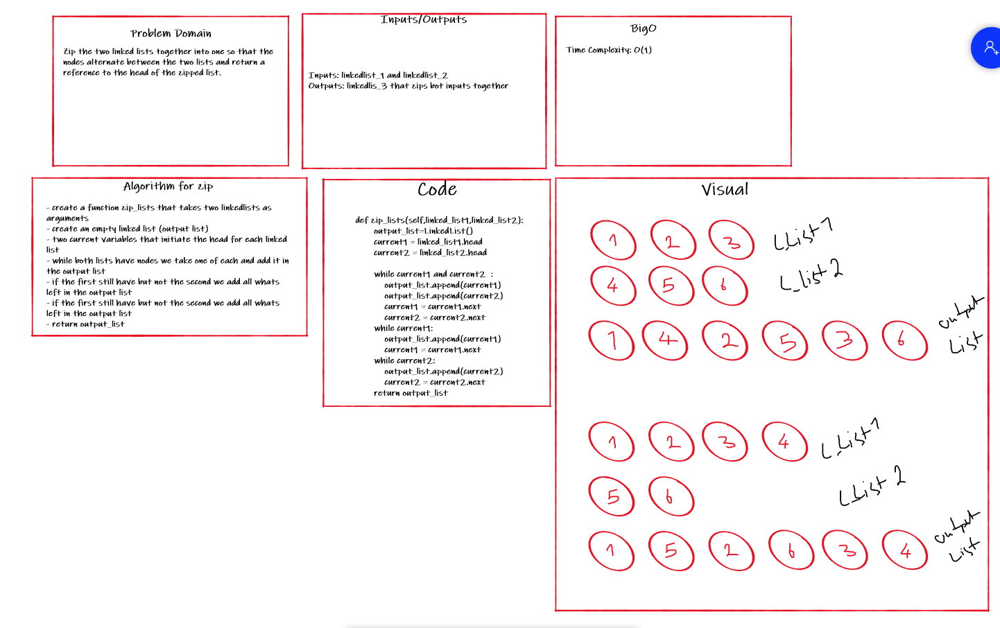
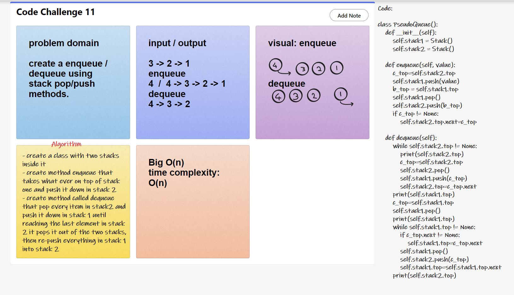
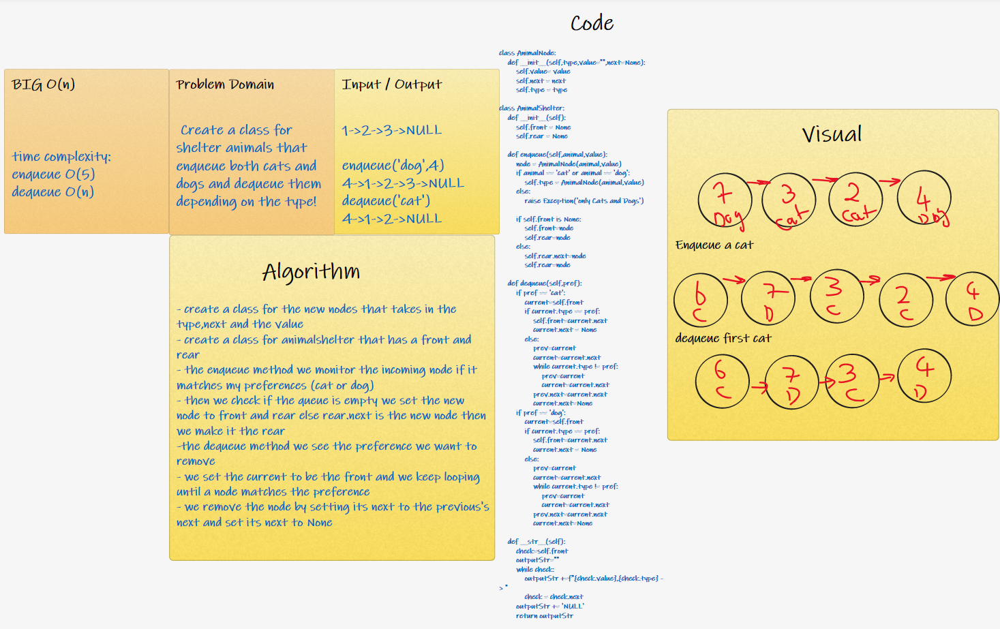
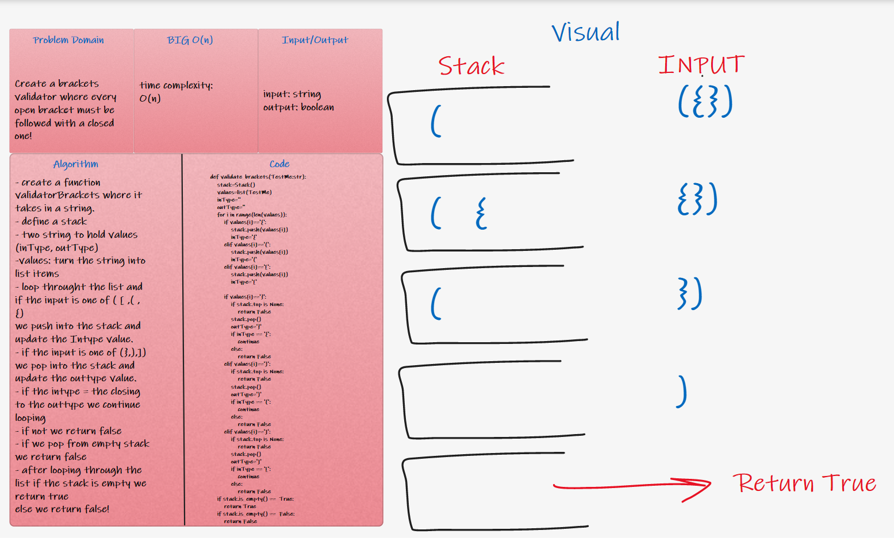
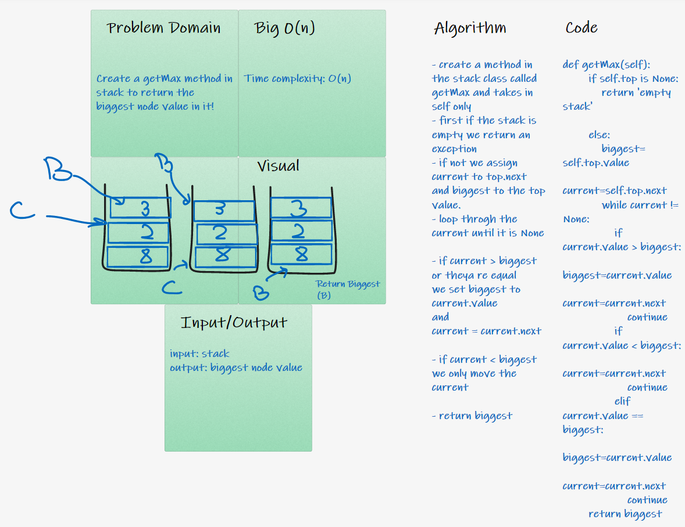
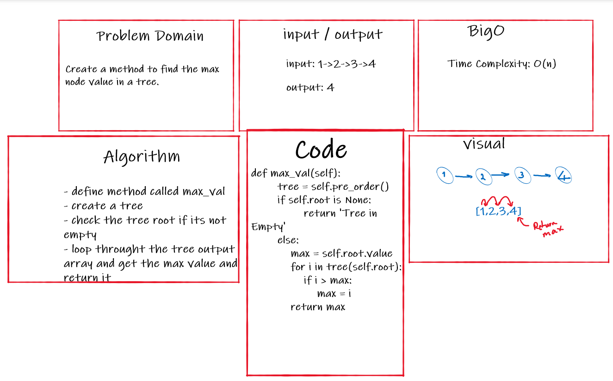
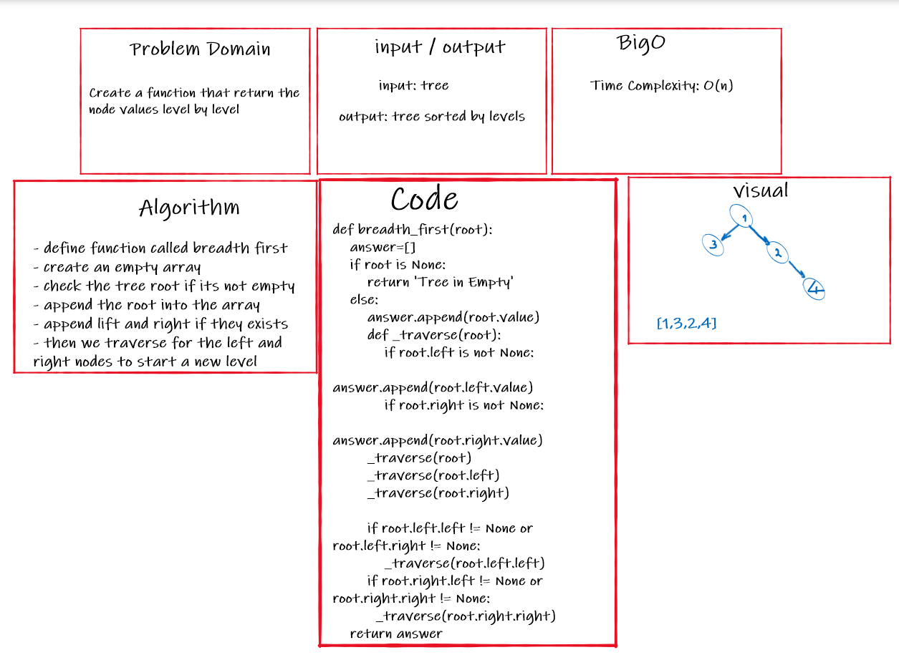

# Data Structures and Algorithms

See [setup instructions](https://codefellows.github.io/setup-guide/code-301/3-code-challenges), in the Code 301 Setup Guide.

## Repository Quick Tour and Usage

### 301 Code Challenges

Under the `javascript` folder, at the top level, is a sub-folder called `code-challenges`

Each day, you'll add one new file to this folder to do your work for the day's assigned code challenge

If you have not already done so, run `npm install` from within this folder to setup your system to be able to run tests using `Jest`

To run your tests

- Change to the `javascript` folder
- run `npm test` to run all of the tests
- run `npm test ##` to only run tests for challenge ## (i.e. 01)

### 401 Data Structures, Code Challenges

- Please follow the instructions specific to your 401 language, which can be found in the directory below, matching your course.

 | whiteboard Challenge Name | Folder Link |
 | ----- | ----- |
 |array-reverse -challenge 1- | [array-reverse](./python/code_challenges/array-reverse)|
 |array-insert-shift -challenge 2- | [array-insert-shift](./python/code_challenges/array-insert-shift)|
 |array-binary-search -challenge 3- | [array-binary-search](./python/code_challenges/array-binary-search)|
 |Linked List -challenge 5- | [Linked List](./python/Linked-List/linked_list)|
 |Linked List -challenge 6- | |
 |Linked List -challenge 7- | | 
 |Linked List -challenge 8- | | 

# Check-list
## 5/11/2021 CC5

- Can successfully instantiate an empty linked list (done in test 1)

- Can properly insert into the linked list (done with test 2)

- The head property will properly point to the first node in the linked list (done within code)

- Can properly insert multiple nodes into the linked list (done with test 3)

- Will return true when finding a value within the linked list that exists ( done with test 5)

- Will return false when searching for a value in the linked list that does not exist ( done wiith test 4)

- Can properly return a collection of all the values that exist in the linked list ( done with test 2 and 3 )

# Singly Linked List
A data structure that contains nodes that links/points to the next node in the list.

## Challenge
Create the data structure for the linked lists were we connect nodes in memory in a sequence.

## API
the class Linked List have 3 methods:
- insert: allow us to add a node to the linked list

- includes: check wether the entered value already exists in a node or not.

- to string: return the linked list in a understoodable sequence.

## 7/11/2021 CC6

- Can successfully add a node to the end of the linked list

- Can successfully add multiple nodes to the end of a linked list

- Can successfully insert a node before a node located i the middle of a linked list

- Can successfully insert a node before the first node of a linked list

- Can successfully insert after a node in the middle of the linked list

- Can successfully insert a node after the last node of the linked list

## Challenge
add nodes dependent on the location defined by the function arguments

## API
added 3 new methods to the class:
- append: allow us to add a node to the linked list

- add before: add a node before the defined node value entered by the user

- add after: add a node after the defined node value entered by the user

## 8/11/2021 CC7

- Where k is greater than the length of the linked list
- Where k and the length of the list are the same
- Where k is not a positive integer
- Where the linked list is of a size 1
- “Happy Path” where k is not at the end, but somewhere in the middle of the linked list

## Challenge
- returns the node value k away from the end

## API
added a new method to the class:
- kth from end: returns the node value k away from the end

## 8/11/2021 CC8

- two linked lists with the same length
- the first linked list is longer than the second one
- the second linked list is longer than the first one

## Challenge
- Zip the two linked lists together into one so that the nodes alternate between the two lists and return a reference to the head of the zipped list.

## API
added a new method to the class:
- zip_lists: takes in two linked lists and start putting items from each one at a time until both lists are empty

# Stacks and Queues
two data structures stacks and queues 

## Challenge
### cc10 11/11/2021

- Can successfully push onto a stack
- Can successfully push multiple values onto a stack
- Can successfully pop off the stack
- Can successfully empty a stack after multiple pops
- Can successfully peek the next item on the stack
- Can successfully instantiate an empty stack
- Calling pop or peek on empty stack raises exception
- Can successfully enqueue into a queue
- Can successfully enqueue multiple values into a queue
- Can successfully dequeue out of a queue the expected value
- Can successfully peek into a queue, seeing the expected value
- Can successfully empty a queue after multiple dequeues
- Can successfully instantiate an empty queue
- Calling dequeue or peek on empty queue raises exception
> All done

## API
### Stack
stack have 4 methods: Push, Pop, Peek, Is empty.
- push: adds node to the stack
- pop: removes node from the stack
- peek: checks the stack top value
- Is_empty: checks whether the stack is empty or not

### Queue
Queue have 4 methods: Enqueue, Dequeue, Peek, Is empty
- Enqueue: adds node to the queue
- Dequeue: removes node from the queue
- peek: checks the queue front value
- Is_empty: checks whether the stack is empty or not

## Challenge
### cc11 14/11/2021

- enqueue queue using stack push and pop
- dequeue queue using stack push and pop
> dequeue not done

## API
### pseudo queue
using some existing classes (stack and node) we need to create a queue that functions in FIFO style.

## Challenge
### cc12 15/11/2021

create a queue for animals (dogs and cats only) where it enqueues only cats or dogs and dequeue the first cat/dog depending on the preference!

## API
### pseudo queue
create an animal node class and animalshelter class from scratch.

## Challenge
### cc13 16/11/2021

function that takes in a string and determine whether the brackets are validate!

## API
### pseudo queue
used a stack to push and pop depending on the bracket entered!

## Challenge
### cc14 17/11/2021

create a stack method that retrns the biggest node value in the stack!

## API
### pseudo queue
compare the current with the next values and always change the biggest value depending on the comparison!

# Trees

## Challenge 18/11 cc15
create the binary tree and the binary search tree

## Approach & Efficiency
using recursive function inside the method itself

## API
### Binary Tree
1. pre_order: return the tree nodes in the following sequence: Root-Left-Right
2. in_order: return the tree nodes in the following sequence: Left-Root-Right
3. post_order: return the tree nodes in the following sequence: Left-Right-Root

### Binary Search Tree
1. Add: add nodes to the search tree depending on the value relative to the node value.
2. Contains: check wether the inserted value exists in the tree
 

## Challenge 21/11 cc16
new method to find the max value

## Approach & Efficiency
get the nodes array and loop it to find the maximum value

## API
### max_value
checks wether the root value isnt None
then gets the tree nodes array and loop it to find the maximum value in that array!

## Challenge 22/11 cc16
new function to find print the tree level by level (breadth-first)

## Approach & Efficiency
traverse level by level and return the nodes

## API
### breadth first
checks wether the root value isnt None
then gets the tree nodes array level by level and print the levels nodes!

