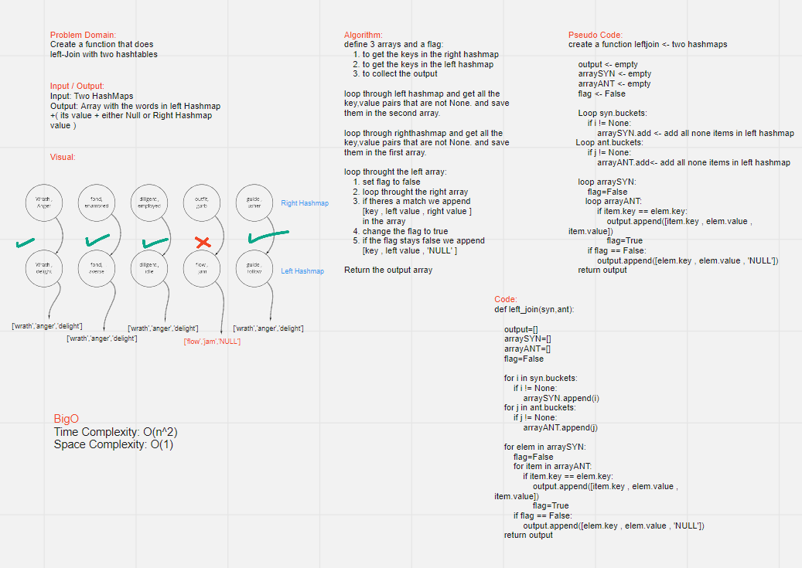

# HashTables

## Code Challenge 33 (Left Join )
### Tests List
1. Test the matches from two hashatbles

### Challenge
create a function that takes in two hasahmaps and compare them together in reference to the left hashmap and 
return either [left.key , left.value , right.value] or [left.key , left.value , 'NULL'] regarding on the existance of the key!

### Approach & Efficiency
get the key,value pairs and start comparing them and fill the output array !

**Big0:** \
Time  Complexity: O(n^2)
Space Complexity: O(1)

### API
1. JoinLeft: if the item is in the left hashmap (synonms) we append to the output array if not we dont look if we have extra keys in the right hashmap!

### WhiteBoaard
