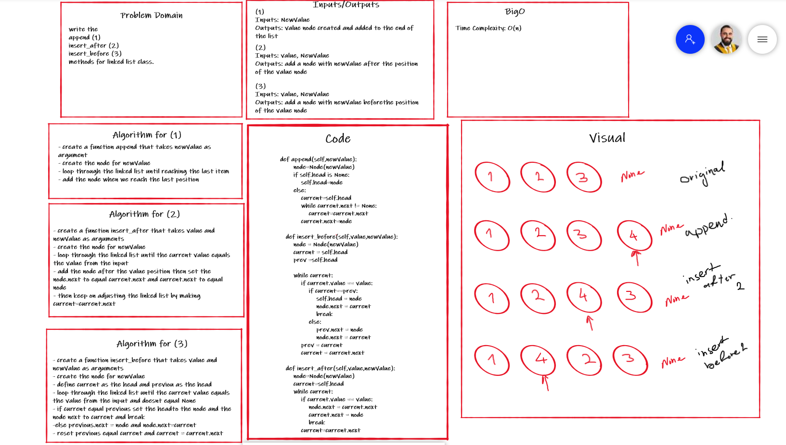

# Check-list
## 5/11/2021 CC5

- Can successfully instantiate an empty linked list (done in test 1)

- Can properly insert into the linked list (done with test 2)

- The head property will properly point to the first node in the linked list (done within code)

- Can properly insert multiple nodes into the linked list (done with test 3)

- Will return true when finding a value within the linked list that exists ( done with test 5)

- Will return false when searching for a value in the linked list that does not exist ( done wiith test 4)

- Can properly return a collection of all the values that exist in the linked list ( done with test 2 and 3 )

# Singly Linked List
A data structure that contains nodes that links/points to the next node in the list.

## Challenge
Create the data structure for the linked lists were we connect nodes in memory in a sequence.

## API
the class Linked List have 3 methods:
- insert: allow us to add a node to the linked list

- includes: check wether the entered value already exists in a node or not.

- to string: return the linked list in a understoodable sequence.

## 7/11/2021 CC6

- Can successfully add a node to the end of the linked list

- Can successfully add multiple nodes to the end of a linked list

- Can successfully insert a node before a node located i the middle of a linked list

- Can successfully insert a node before the first node of a linked list

- Can successfully insert after a node in the middle of the linked list

- Can successfully insert a node after the last node of the linked list

## Challenge
add nodes dependent on the location defined by the function arguments

## API
added 3 new methods to the class:
- append: allow us to add a node to the linked list

- add before: add a node before the defined node value entered by the user

- add after: add a node after the defined node value entered by the user

## 8/11/2021 CC7

- Where k is greater than the length of the linked list
- Where k and the length of the list are the same
- Where k is not a positive integer
- Where the linked list is of a size 1
- “Happy Path” where k is not at the end, but somewhere in the middle of the linked list

## Challenge
- returns the node value k away from the end

## API
added a new method to the class:
- kth from end: returns the node value k away from the end

## 8/11/2021 CC8

- two linked lists with the same length
- the first linked list is longer than the second one
- the second linked list is longer than the first one

## Challenge
- Zip the two linked lists together into one so that the nodes alternate between the two lists and return a reference to the head of the zipped list.

## API
added a new method to the class:
- zip_lists: takes in two linked lists and start putting items from each one at a time until both lists are empty

