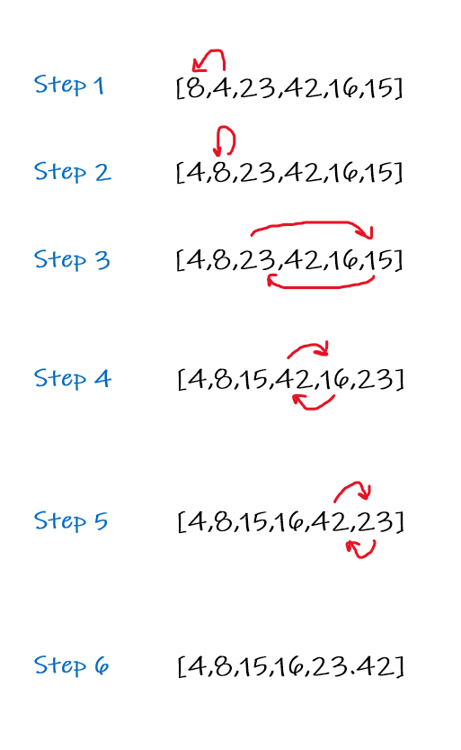

# Insertion Sort
Selection Sort is a sorting algorithm that traverses the array multiple times as it slowly builds out the sorting sequence. The traversal keeps track of the minimum value and places it in the front of the array which should be incrementally sorted.

## Pesudo Code
   
    InsertionSort(arr)
      FOR i = 1 to arr.length

        int j <-- i - 1
        int temp <-- arr[i]

        WHILE j >= 0 AND temp < arr[j]
          arr[j + 1] <-- arr[j]
          j <-- j - 1

        arr[j + 1] <-- temp
&nbsp;

## Tracing
[8,4,23,42,16,15]

step 1: compare current value (8), because 4 is smaller than the rest pf the items we replace it \
[4,8,23,42,16,15]

step 2: compare current value (8), because 8 is the smallest we dont switch! \
[4,8,23,42,16,15]

step 3: compare current value (23), we have a smaller number which is 15 so replace them  \
[4,8,15,42,16,23]

step 4: compare current value (42), we have a smaller number which is 16 so replace them  \
[4,8,15,16,42,23]

step 5: compare current value (42), we have a smaller number which is 23 so replace them  \
[4,8,15,16,23,42]

#### Now We have a sorted list!

## Big0
1. Time Complexity:  O(n^2)
2. Space Complexity: O(1)