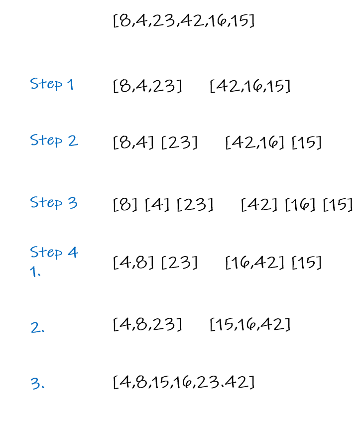

# Merge Sort
It divides the input array into two halves, calls itself for the two halves, and then merges the two sorted halves. The merge() function is used for merging two halves.

## Pesudo Code

    ALGORITHM Mergesort(arr)
    DECLARE n <-- arr.length

    if n > 1
      DECLARE mid <-- n/2
      DECLARE left <-- arr[0...mid]
      DECLARE right <-- arr[mid...n]
      // sort the left side
      Mergesort(left)
      // sort the right side
      Mergesort(right)
      // merge the sorted left and right sides together
      Merge(left, right, arr)

    ALGORITHM Merge(left, right, arr)
    DECLARE i <-- 0
    DECLARE j <-- 0
    DECLARE k <-- 0

    while i < left.length && j < right.length
        if left[i] <= right[j]
            arr[k] <-- left[i]
            i <-- i + 1
        else
            arr[k] <-- right[j]
            j <-- j + 1

        k <-- k + 1

    if i = left.length
       set remaining entries in arr to remaining values in right
    else
       set remaining entries in arr to remaining values in left

&nbsp;

## Tracing
[8,4,23,42,16,15]

step 1: merge sort into 2 arrays \
[8,4,23] , [42,16,15]

step 2: mergesort each array into 2 arrays \
[8,4] , [23] , [42,16] , [15]

step 3: mergesort each array into arrays of length 1 \
[8],[4],[23],[42],[16],[15]

step4: now that no arrays are longer than 1 in length we merge the arrays \

> 1. [4,8] , [23] , [16,42] , [15]
> 2. [4,8,23] , [16,15,42]
> 3. [4,8,15,16,23,42]

#### Now We have a sorted list!

## Big0
1. Time Complexity:  O(nlogn)
2. Space Complexity: O(n)