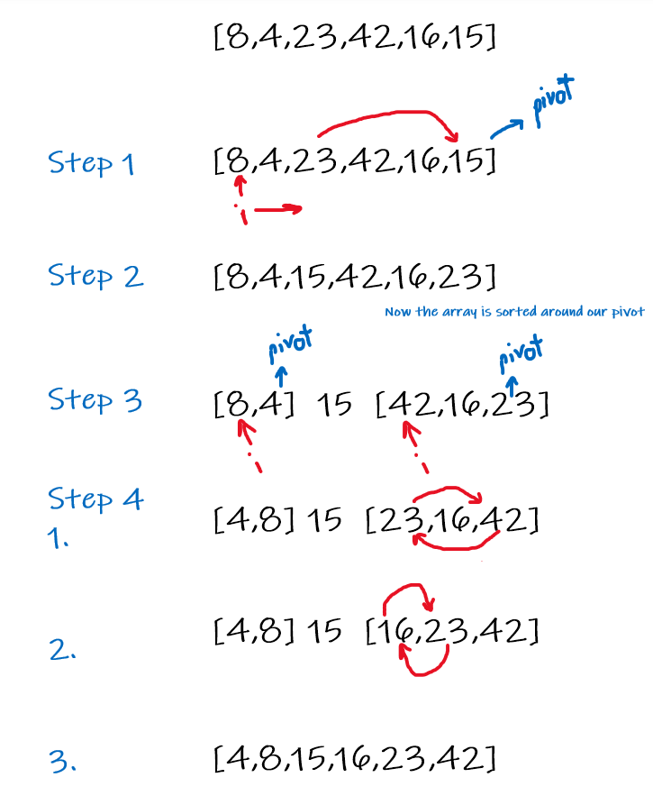

# Quick Sort
It divides the input array into two halves centered by the pivot (the last item in the array), then redo the process for each half until all the array is sorted.

## Pesudo Code

    ALGORITHM QuickSort(arr, left, right)
    if left < right
        // Partition the array by setting the position of the pivot value
        DEFINE position <-- Partition(arr, left, right)
        // Sort the left
        QuickSort(arr, left, position - 1)
        // Sort the right
        QuickSort(arr, position + 1, right)

    ALGORITHM Partition(arr, left, right)
    // set a pivot value as a point of reference
    DEFINE pivot <-- arr[right]
    // create a variable to track the largest index of numbers lower than the defined pivot
    DEFINE low <-- left - 1
    for i <- left to right do
        if arr[i] <= pivot
            low++
            Swap(arr, i, low)

     // place the value of the pivot location in the middle.
     // all numbers smaller than the pivot are on the left, larger on the right.
     Swap(arr, right, low + 1)
    // return the pivot index point
     return low + 1

    ALGORITHM Swap(arr, i, low)
    DEFINE temp;
    temp <-- arr[i]
    arr[i] <-- arr[low]
    arr[low] <-- temp

&nbsp;

## Tracing
[8,4,23,42,16,15]

step 1: we swap 23 with 15 as its bigger than it! \
[8,4,15,42,16,23]

step 2: if left is smaler thean right (and it is) we start Partition.
paritation sets the last element as a pivot and start sorting the values to its left and right (left: smaller than the pivot / right:larger than the pivot) \
[8,4,15,42,16,23]

step 3: now that we are sure that (15) our pivot is in the center we start paritation to each side! \
[8,4] 15 [42,16,23]

step 4: 
1. paritate the left array \
[4,8] 15 [42,16,23]
2. paritate the right array \
[4,8] 15 [16,23,42]
3. merge back the arrays! \
[4,8,15,16,23,42]

#### Now We have a sorted list!

## Big0
1. Time Complexity:   O(log n)
2. Space Complexity: O(n)