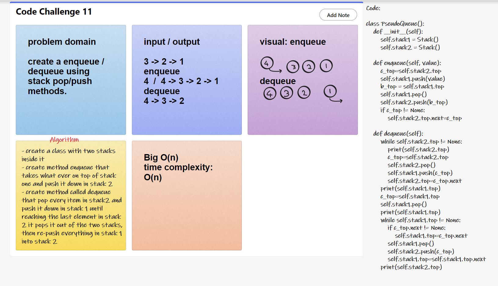
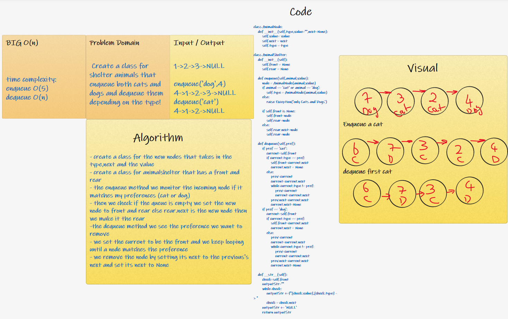

# Stacks and Queues
two data structures stacks and queues 

## Challenge
### cc10 11/11/2021

- Can successfully push onto a stack
- Can successfully push multiple values onto a stack
- Can successfully pop off the stack
- Can successfully empty a stack after multiple pops
- Can successfully peek the next item on the stack
- Can successfully instantiate an empty stack
- Calling pop or peek on empty stack raises exception
- Can successfully enqueue into a queue
- Can successfully enqueue multiple values into a queue
- Can successfully dequeue out of a queue the expected value
- Can successfully peek into a queue, seeing the expected value
- Can successfully empty a queue after multiple dequeues
- Can successfully instantiate an empty queue
- Calling dequeue or peek on empty queue raises exception
> All done

## API
### Stack
stack have 4 methods: Push, Pop, Peek, Is empty.
- push: adds node to the stack
- pop: removes node from the stack
- peek: checks the stack top value
- Is_empty: checks whether the stack is empty or not

### Queue
Queue have 4 methods: Enqueue, Dequeue, Peek, Is empty
- Enqueue: adds node to the queue
- Dequeue: removes node from the queue
- peek: checks the queue front value
- Is_empty: checks whether the stack is empty or not

## code challenge 11 

## code challenge 12

